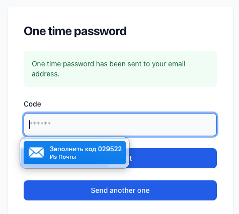

# One time passwords for Laravel

In a very simple case, our Laravel applications authenticate users by login 
and password. Sometimes we force our applications to verify users' emails.

This package requires users to periodically re-verify emails using one time 
passwords.

The authentication process will be:

* user signs-in with login and password
* application sends an email with one time password
* user affirms authentication providing this password



## Installation

Install service. Publish Service Provider and view.

```php
composer require codewiser/otp-authenticate

php artisan vendor:publish --tag=otp
```

Register `\App\Providers\OtpServiceProvider` to `bootstrap/providers.php` file.

Customize the view published to `resources/views/vendor/otp`.

### Service Provider

Configure the frequency of email re-verification and rate limiters in a service 
provider class.

_Providers/OtpServiceProvider.php_

```php
<?php

namespace App\Providers;

use Codewiser\Otp\OtpService;
use Codewiser\Otp\RateLimiter\Throttle;
use Illuminate\Http\Request;
use Illuminate\Support\Facades\RateLimiter;
use Illuminate\Support\ServiceProvider;

class OtpServiceProvider extends ServiceProvider
{
    /**
     * Register any application services.
     */
    public function register(): void
    {
        $this->app->singleton(OtpService::class, 
            fn($app) => new OtpService('P1W')
        );
    }

    /**
     * Bootstrap any application services.
     */
    public function boot(): void
    {
        RateLimiter::for(Throttle::issue, fn(Request $request) => [
            // Rate Limits for issuing new otp code
        ]);

        RateLimiter::for(Throttle::verify, fn(Request $request) => [
            // Rate Limits for verifying otp code (bruteforce protection)
        ]);
    }
}
```

Predefined `otp` routes are protected with `throttle` middleware using names 
mentioned above. 

### Otp service constructor

`OtpService` class constructor has one optional parameter. It is a string in
[date interval](https://www.php.net/manual/en/dateinterval.construct.php) 
format.

For example, if we define `new OtpService('P1M')`, users will sign in 
using otp at least once a month.

Empty constructor `new OtpService()` means that every authentication process 
is accompanied by an otp.

> Either way, the otp process will be invoked no more often than once 
> during user session.

### Otp user contract

Apply the `MustVerifyEmailWithOtp` contract and the `MustVerifyEmailWithOtp` 
trait to a `User` model. This contract and trait extend the well known 
`MustVerifyEmail`.

_Models/User.php_

```php
use Codewiser\Otp\Contracts\MustVerifyEmailWithOtp;
use Codewiser\Otp\Traits\MustVerifyEmailWithOtp as HasOtp;
use Illuminate\Foundation\Auth\User as Authenticatable;

class User extends Authenticatable implements MustVerifyEmailWithOtp {
    use HasOtp;
    
    //
}
```

### Protecting routes

Use the `EnsureOtpIsPassed` middleware to protect only stateful (`web`) requests.

To protect stateless (`api`) requests, keep using 
`EnsureEmailIsVerified` (aka `verified`) middleware.

_routes/web.php_

```php
use Codewiser\Otp\Middleware\EnsureOtpIsPassed;
use Illuminate\Support\Facades\Route;

Route::middleware(['auth', EnsureOtpIsPassed::class])->group(function () {
    //
});
```

## Customization

You may change the published blade template (see `resources/views/vendor/otp`), 
or you may register a custom view. You may register a custom function to 
generate otp codes. And you may register a custom function for composing a 
notification.

```php
use Codewiser\Otp\OtpService;
use Codewiser\Otp\Notifications\EmailWithOtp;
use Illuminate\Support\ServiceProvider;

class OtpServiceProvider extends ServiceProvider
{
    /**
     * Bootstrap any application services.
     */
    public function boot(): void
    {
        OtpService::view(fn() => view('otp.custom-view'));
        
        OtpService::newCodeUsing(fn() => rand(1000, 9999));
        
        EmailWithOtp::toMailUsing(function(object $notifiable, string $otp) {
            //
        });
    }
}
```